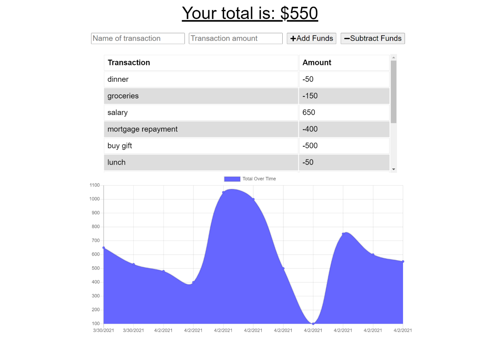
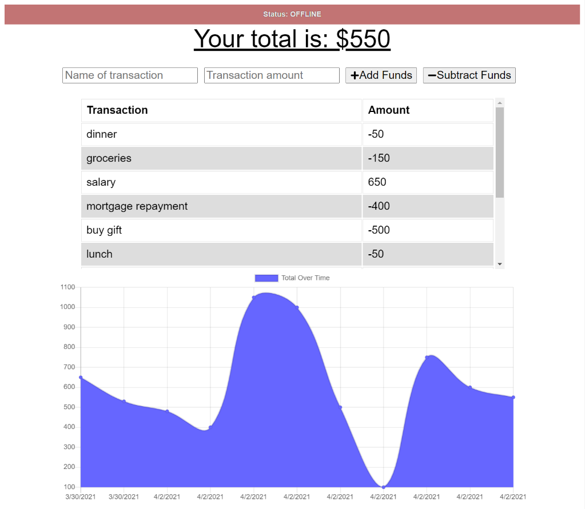
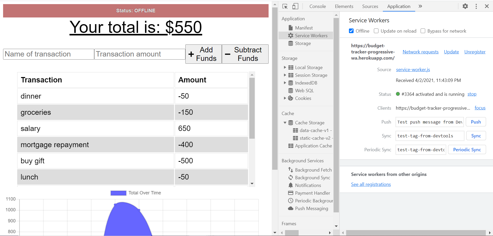

# Budget Tracker PWA

## Overview
---
This is a Node.js & MongoDB Web Application where user can input their income and expense and track the current amount. Also designed to support offline and download features as a Progressive Web Application.

## Table of Contents
---
* [Version History](#version-history)
* [How It Works](#how-it-works)

* [Links](#links)
* [License](#license)
* [Acknowledgements](#acknowledgements)  

## Version History
---
* Version 0.0 - 02-April-2021
    initial working webapp  

## How It Works
---
1. Click the following [Link](https://budget-tracker-progressive-wa.herokuapp.com/) to go to the deployed website
    
2. Enter "Name of Transaction" and the "Amount", then click "Add Funds" or "Subtract Funds" depending on the type of transaction. Then the data will be displayed on the table and on the chart below to table to keep track of the progress.
The current amount is shown as "Total Amount" on the top of the page.

3. This web application has an offline features, which means you can still view and add transactions when you are offline, and view the updated "Total Amount" as well.
Offline Status will pop-up on the top of the page when there is no internet connection and will change to Online when you are connected back to the internet and will sync all the transactions you have added while offline.

4. To check if the web application can be operated offline, please check if the service worker has been installed successfuly as shown on the image below.

## Links
---
* [ GitHub Source Code](https://github.com/vsumargo/Budget-Tracker-PWA)  

* [Budget Tracker PWA](https://budget-tracker-progressive-wa.herokuapp.com/)

## License
---
License under the MIT license  

## Acknowledgements
---
* **Trilogy Education Services & UWA Coding Bootcamp** - for design guides

* **Luca & Sam** - for their time in teaching the coding bootcamp course.

